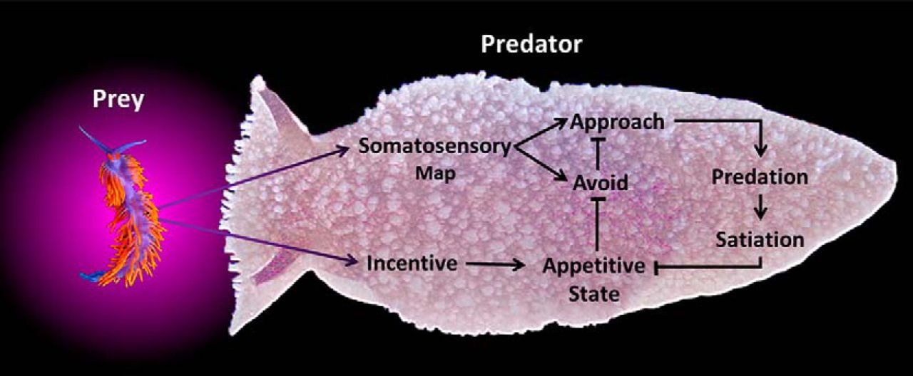
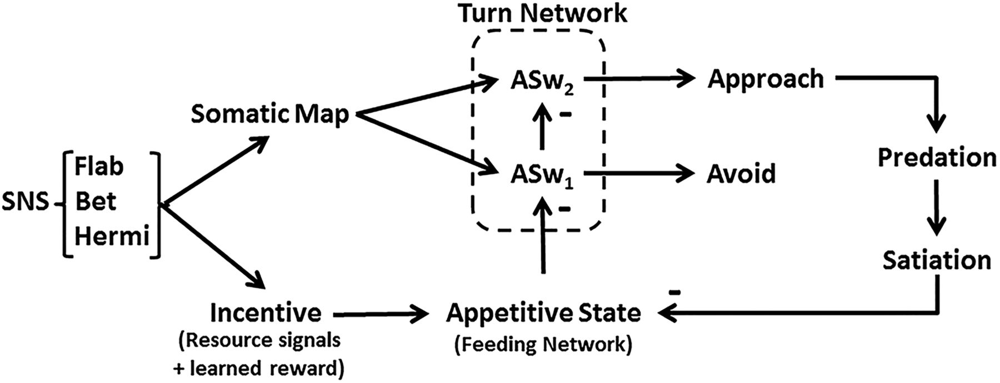

# Cyberslug
## Simulation of Goal-Directed Foraging Decisions of The Sea Slug *Pleurobranchaea*

## About

A Python implementation of the Cyberslug model, as originally described in:  
Brown, Jeffrey W., Derek Caetano-Anollés, Marianne Catanho, Ekaterina Gribkova, Nathaniel Ryckman, Kun Tian, Mikhail Voloshin, and Rhanor Gillette. "Implementing goal-directed foraging decisions of a simpler nervous system in simulation." Eneuro 5, no. 1 (2018).  
https://www.eneuro.org/content/5/1/ENEURO.0400-17.2018

Originally implemented in NetLogo:  
https://github.com/Entience/Cyberslug
as well as javascript:  
https://mikhailvoloshin.com/cyberslug/

